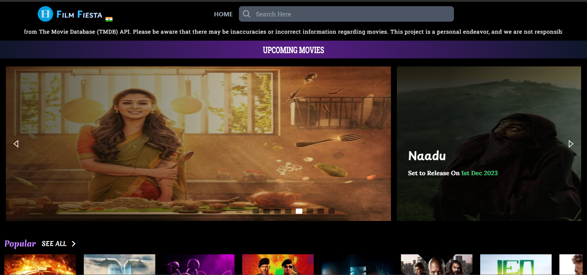

# Film Fiesta


Film Fiesta is a movie information web app that fetches data from The Movie Database (TMDB) API. It provides details on trending, upcoming, top-grossing, popular, and top-rated movies. The UI is enhanced with beautiful animations using Framer Motion, and images are rendered using React-Image library. A loading spinner powered by React-Spinner is displayed during data fetching. The project includes an infinite scroll data fetcher for a seamless user experience. This project is built with Vite, React, and TypeScript, styled with Tailwind CSS.

Create your Account in [TMDB API](https://developer.themoviedb.org/reference/intro/getting-started)

### How to Run Locally

1. Clone the repository.
2. Install dependencies: `npm install`.
3. Create a `.env` file with the following details:

```
VITE_API_KEY=your_tmdb_api_key
VITE_API_ACCESS_TOKEN=your_tmdb_api_access_token
VITE_IMAGE_URL=https://image.tmdb.org/t/p/original
VITE_API_URL=https://api.themoviedb.org/3
```

Replace `your_tmdb_api_key` and `your_tmdb_api_access_token` with your TMDB API key and access token.

4. Run the project: `npm run dev`.


### Screenshots



### License

This project is licensed under the MIT License - see the [LICENSE](LICENSE) file for details.

## Author : Prathamesh Dhande
